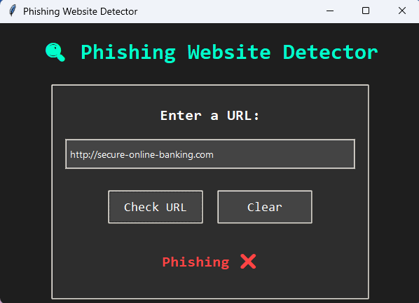
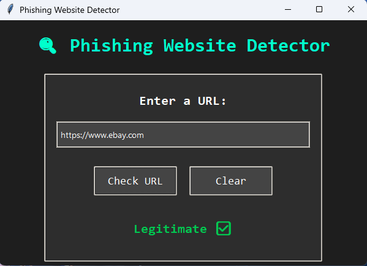

# Phishing Website Detector

<p align="center">
  
  
</p>

  A machine learning-based tool to detect phishing websites. This project uses a Random Forest classifier trained on a dataset of phishing and legitimate URLs to predict whether a given URL is phishing or legitimate.

## Features
- Train a model using a dataset of phishing and legitimate URLs.
- Predict whether a URL is phishing or legitimate using a GUI or Flask API.

## Installation
1. Clone the repository.
2. Install dependencies: `pip install -r requirements.txt`.
3. Train the model: `python src/train_model.py`.
4. Run the Flask API: `python src/app.py`.
5. Run the GUI: `python src/gui.py`.

## Usage
- Enter a URL in the GUI and click **Check URL** to see the prediction.
- Send a POST request to the Flask API at `/predict` with a JSON payload:
  ```json
  {
      "url": "http://example.com"
  }